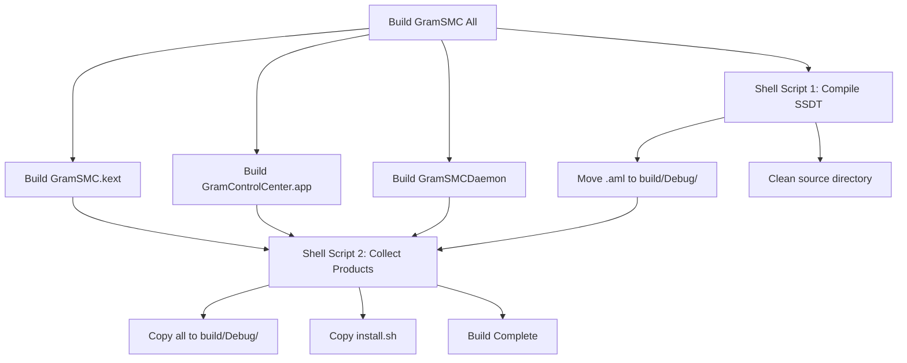

# GramSMC Build System - Summary of Changes

**Date**: January 2, 2026
**Version**: 1.5.0

## Problems Solved

### 1. ✅ Products buried deep in DerivedData
**Before**: `/Users/glenm/Library/Developer/Xcode/DerivedData/GramSMC-xxx/Build/Products/Debug/`
**After**: `/Users/glenm/GramSMC/build/Debug/`

### 2. ✅ SSDT compilation creates artifacts in source directory
**Before**: Both `.dsl` and `.aml` files in `GramSMC/` directory
**After**: Only `.dsl` in source, `.aml` in `build/` directory

### 3. ✅ No centralized installation
**Before**: Manual copying of files
**After**: One-command `install.sh` script in build directory

### 4. ✅ No existing service cleanup
**Before**: Manual killing and uninstalling required
**After**: `install.sh` automatically stops and uninstalls old versions

## What Was Changed

### Modified Files

1. **`GramSMC.xcodeproj/project.pbxproj`**
   - Added two shell script build phases to "GramSMC All" target:
     - Phase 1: Compiles SSDT and moves `.aml` to `build/` directory
     - Phase 2: Collects all products to `build/` directory

### Created Files

1. **`Scripts/install_daemon_app.sh`** - Installation script for daemon and app
2. **`build/README.md`** - Documentation for build directory
3. **`BUILD_SYSTEM_CHANGES.md`** - Detailed technical documentation
4. **`QUICK_START.md`** - Quick start guide for users

## How to Use

### Building (One Command)
```bash
# In Xcode:
# 1. Select "GramSMC All" scheme
# 2. Press ⌘B

# Everything appears in: build/Debug/
```

### Installing (One Command)
```bash
cd /Users/glenm/GramSMC/build/Debug
./install.sh
```

### What Gets Installed Automatically
- ✅ GramSMCDaemon → `/usr/local/bin/`
- ✅ GramControlCenter.app → `/Applications/`
- ✅ LaunchAgent plist → `/Library/LaunchAgents/`
- ✅ Daemon auto-started

### What Requires Manual Installation
- ❌ GramSMC.kext → Copy to OpenCore `EFI/OC/Kexts/`
- ❌ SSDT-GramSMC.aml → Copy to OpenCore `EFI/OC/ACPI/`
- ❌ Update `config.plist` to enable both
- ❌ Reboot

## Build Directory Contents

After building "GramSMC All", the `build/Debug/` directory contains:

```
build/Debug/
├── GramSMC.kext/                   ← Copy to OpenCore
├── GramControlCenter.app/          ← Auto-installed by script
├── GramSMCDaemon                   ← Auto-installed by script
├── com.gramsmc.GramSMCDaemon.plist ← Auto-installed by script
├── SSDT-GramSMC.aml                ← Copy to OpenCore
├── install.sh                      ← Run to install daemon/app
└── README.md                       ← Full documentation
```

## Source Directory Organization

The source directory stays clean:

```
GramSMC/
├── SSDT-GramSMC.dsl    ✅ Source file (kept)
└── [NO .aml or .hex]   ✅ Artifacts removed
```

## Build Process Flow



## Technical Details

### Shell Script Phase 1 (SSDT Compilation)
- **Input**: `GramSMC/SSDT-GramSMC.dsl`
- **Output**: `build/${CONFIGURATION}/SSDT-GramSMC.aml`
- **Action**: Compile with `iasl`, move `.aml` out, clean `.hex` artifacts

### Shell Script Phase 2 (Product Collection)
- **Input**: Products from DerivedData
- **Output**: Copies to `build/${CONFIGURATION}/`
- **Files**: Kext, App, Daemon, Plist, Install script

### Installation Script
- **Location**: `Scripts/install_daemon_app.sh`
- **Features**:
  - Stops existing daemon/app gracefully
  - Uninstalls old versions
  - Installs new versions
  - Sets correct permissions
  - Starts daemon automatically
  - Provides manual instructions for kext/SSDT

## Version Management

All components use unified version **1.5.0**:
- Defined in `GramSMCVersion.h` (root)
- Set in Xcode project (`MODULE_VERSION`, `MARKETING_VERSION`)
- Referenced by all components dynamically

## Verification Commands

### Check build output
```bash
ls -lh /Users/glenm/GramSMC/build/Debug/
```

### Check source is clean
```bash
ls /Users/glenm/GramSMC/GramSMC/SSDT*
# Should only show: SSDT-GramSMC.dsl
```

### Check installation
```bash
# Daemon
ps aux | grep GramSMCDaemon

# App
ls -la /Applications/GramControlCenter.app

# Kext (after manual install + reboot)
kextstat | grep GramSMC

# SSDT (after manual install + reboot)
ioreg -l | grep GRAM0001
```

## Documentation Files

1. **QUICK_START.md** - Quick guide for users
2. **build/README.md** - Build directory documentation
3. **BUILD_SYSTEM_CHANGES.md** - Technical details
4. **This file** - Summary of all changes

## Benefits

✅ **Predictable locations** - No more searching DerivedData
✅ **Clean source tree** - No build artifacts in Git
✅ **One-command install** - Automated daemon/app installation
✅ **Proper cleanup** - Stops old versions before installing
✅ **All-in-one package** - Everything needed in one folder
✅ **Easy distribution** - Zip build folder and share
✅ **Clear separation** - Auto-install vs manual install (OpenCore)

## Backwards Compatibility

- ✅ Individual targets (GramSMC, GramSMCDaemon, GramControlCenter) unchanged
- ✅ Only "GramSMC All" target has new behavior
- ✅ No breaking changes to existing workflows
- ✅ Can still build individual components separately

## Next Steps

1. Build the project: Select "GramSMC All" and press ⌘B
2. Install daemon/app: `cd build/Debug && ./install.sh`
3. Manually install kext/SSDT to OpenCore
4. Reboot and enjoy!

---

**Version**: 1.5.0
**Last Updated**: January 2, 2026
**Maintainer**: GramSMC Contributors
